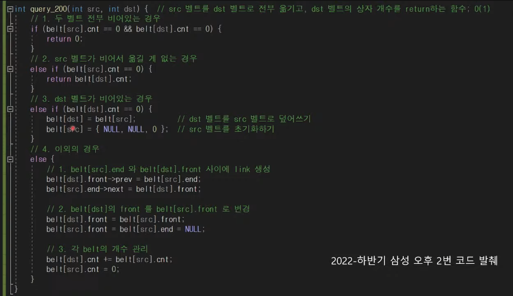

# 목표
* 매일 1문제씩 풀기
* 매주 일요일 11:30 AM LeetCode Weekly Contest 참여

# 공부 방법
1. 정확히 이해하고 넘어가자.
- 주석을 열심히 달기
  - 주석을 문장 형태를 이루어서 작성
  - 변수들은 의미를 설명하기
  - 함수들은 입력, 출력 그리고 시간 복잡도를 설명하기
  - 각 줄마다 문장으로 설명하기
  - 예시
    

2. 시간을 정해 놓고 풀자.
- 난이도에 맞는 유동적인 시간 설정
  - 삼성 기출: 2시간
  - ~ Sliver: 30분
  - ~ Gold: 1시간
- 시간이 지나면 빠르게 해설보고 이해한 뒤, 코드를 전부 지우고 다시 처음부터 반복한다.

3. 다음 질문들에 대해 대답해보자.
- 시간 복잡도는?
  - Step 마다 계산하고, 설명하기
- 공간 복잡도는?
  - 사용한 자료구조마다 계산하고 설명하기
- 어려웠던 부분은?
  - 어떻게 해결했는지 설명하기

